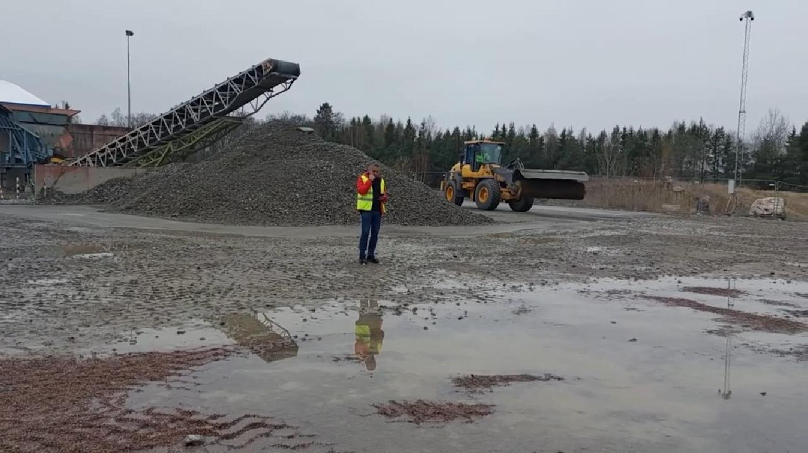
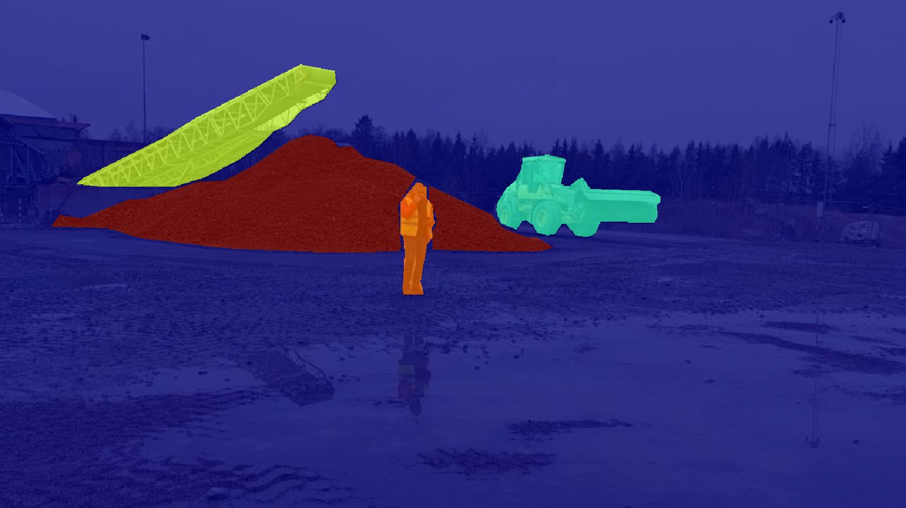

# ConstScene: A Dataset and Model for Advancing Robust Semantic Segmentation in Construction Environments


<p float="left">
  
  
</p>


## Overview
This repository accompanies the paper "ConstScene: A Dataset and Model for Advancing Robust Semantic Segmentation in Construction Environments" authored by Maghsood Salimi, Mohammad Loni, Sara Afshar, Marjan Sirjani, and Antonio Cicchetti from Mälardalen University and Volvo Construction Equipment.

## Abstract
The increasing demand for autonomous machines in construction environments necessitates the development of robust object detection algorithms that can perform effectively across various weather and environmental conditions. This paper introduces the ConstScene dataset, a semantic segmentation dataset tailored for construction sites, addressing challenges posed by diverse weather conditions. The dataset enhances the training and evaluation of object detection models, fostering adaptability and reliability in real-world construction applications.

## Dataset
Our semantic segmentation dataset called `ConstScene` consists of seven distinct classes, addressing various objects commonly found in construction environments. It includes original images plus annotated ones captured under a wide range of weather conditions, such as sunny days, rainy periods, foggy atmospheres, and low-light situations. Additionally, environmental factors like dirt/mud on the camera lens are integrated into the dataset through actual captures, simulating complex conditions in construction sites. We provide two versions of the dataset to cater to different use cases.

### Version 1: Original Dataset
The original version of the dataset includes images captured in diverse weather conditions and environmental settings. Each image is annotated with precise semantic segmentation masks for seven classes: construction-machine, human, car, crusher, pile, road, and background. This version is suitable for training and evaluating models under realistic scenarios.

**Download Link:** [Original Dataset](https://drive.google.com/file/d/1Dn5jv8PNX-NHKdkGJ9velyG_4AI--Cz9/view?usp=drive_link)

### Version 2: Original Dataset Plus Augmented Samples
To enhance model robustness and performance, we present an augmented version of the dataset. In addition to the original images, this version includes augmented images generated through techniques such as blur, noise, and cut-out. The semantic segmentation masks for the seven classes are meticulously adjusted to match the augmented images.

**Download Link:** [Augmented Dataset](https://drive.google.com/file/d/16VDeLf5lXPz7qkhhddziXXJmjQ2Nyp22/view?usp=drive_link)


### Dataset Structure
```
/data/D1/
        ├── train/
        │   ├ _classes.csv
        │   ├ image1.jpg
        │   ├ image1_mask.png
        │   ├ image2.jpg
        │   └ image2_mask.png
        ├── valid/
        │   ├ image1.jpg
        │   ├ image1_mask.png
        │   ├ image2.jpg
        │   └ image2_mask.png
        └── test/
            ├ image1.jpg
            ├ image1_mask.png
            ├ image2.jpg
            └ image2_mask.png        
```


## Code
The code is available in the `constscene` folder. It includes scripts for training, evaluation, and other relevant tasks.

### Dependencies
Ensure you have the following dependencies installed:
- List of dependencies with versions.
- Instructions on installing dependencies.

### Usage
1. **SegFormer:** To train the Segformer model on your dataset using the `constscene_segformer.py` script, you can use the following command-line arguments:

```bash
python constscene_segformer.py --epochs 64 --model b0 -d D1 -lr 3e-4 -b 300 -ih 96 -iw 128 --feature_size 128

```

Command-line Arguments:

`-` --epochs: Number of epochs to train the model (default: 64).

--model: Segformer model architecture, choose between 'b0' or 'b5' (default: 'b0').

-d or --database: Database type, choose between 'D1' (data without augmentation) or 'D2' (data with augmentation).

-lr or --learning_rate: Initial learning rate (default: 3e-4).

-b or --batch_size: Batch size for training (default: 300).

-ih or --input_height: Input images height (default: 96).

-iw or --input_width: Input images width (default: 128).

--feature_size: Feature extractor size (default: 128).

Example:
Train the Segformer model on the augmented dataset (D2) with a batch size of 300 for 64 epochs:


2. **Evaluation:** Evaluate the model's performance with:
    ```bash
    python evaluate.py --options
    ```
3. ...

For more detailed instructions on code usage and customization, refer to the [Code Documentation](code/README.md).


## Contact
For questions or inquiries, please contact:
- Maghsood Salimi (maghsood.salimi@mdu.se)
- Mohammad Loni (mohammad.loni@volvo.com)


## Acknowledgments
This work was conducted in collaboration with the Future Solutions department of Volvo Construction Equipment AB, Sweden. 

## Citation
If you use this dataset or code in your research, please cite our paper. For citation details, refer to [CITATION.md](CITATION.md).

## License

<a rel="license" href="https://creativecommons.org/licenses/by-nc-nd/3.0/"></a>


